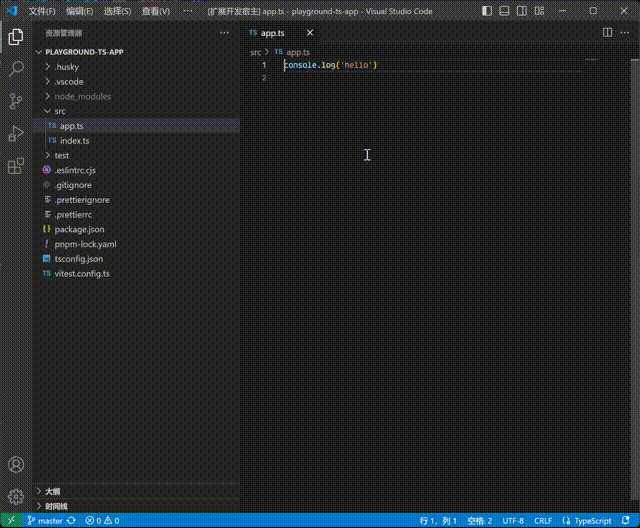

# Auto Organize Imports

## 链接

- [github仓库](https://github.com/lsby/vscode-auto-organize-import)
- [vscode商店](https://marketplace.visualstudio.com/items?itemName=lsby-vscode-auto-organize-import)

## 概述

一个 VSCode 插件，它能够在保存 TypeScript、JavaScript 文件时，自动整理 `import` 语句。

每当你保存 `.ts`, `.tsx`, `.js`, 或 `.jsx` 文件时，插件会自动调用 VSCode 自带的 "Organize Imports" 功能，帮助你保持代码整洁。

## 功能

- 自动整理 `import` 语句，每次保存文件时触发。
- 支持以下文件类型：
  - TypeScript (`.ts`)
  - TypeScript React (`.tsx`)
  - JavaScript (`.js`)
  - JavaScript React (`.jsx`)

## 使用

1. 打开 `.ts`, `.tsx`, `.js`, 或 `.jsx` 文件。
2. 编辑文件内容。
3. 每当保存文件时，插件将自动调用 `editor.action.organizeImports` 命令。

## 演示

